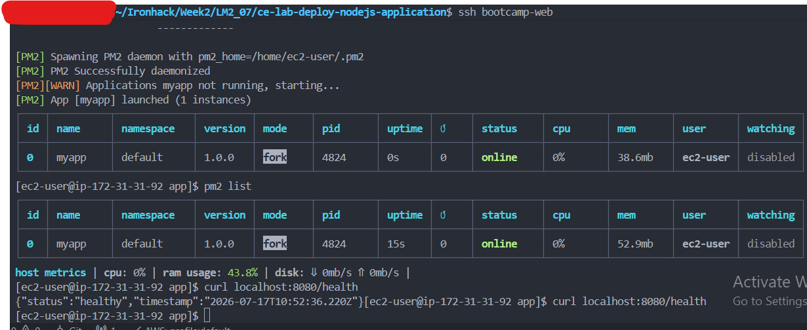
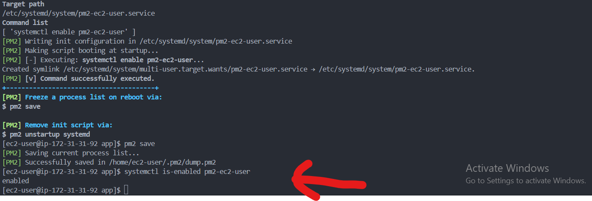
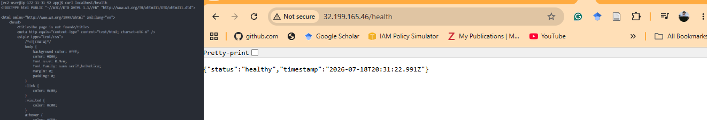
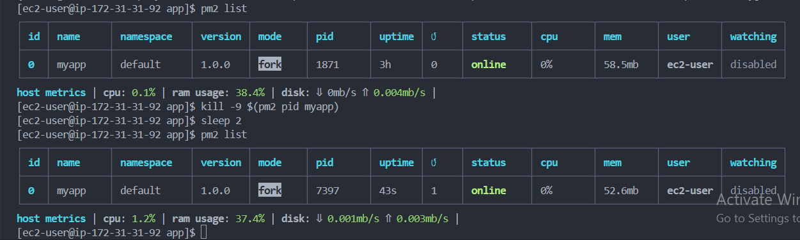
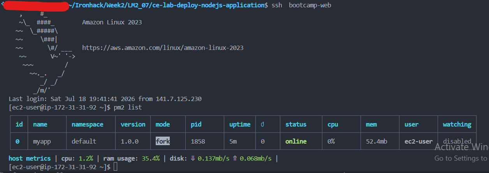

# Deploy Node.js Application Lab - Solution

**Student Name:** Hafiz Abdul Quddus
**Date Completed:** 17-07-2026

---

# Environment Details

| Item            | Value               |
| --------------- | ------------------- |
| Instance ID     | i-06c1e6c3e50545fa6 |
| Region          | us-east-1           |
| Public IP       | 32.199.165.46       |
| Node.js Version | v18.20.8            |
| App Name (PM2)  | myapp               |
| App Port        | 8080                |

---

# Step 1: Install Node.js

- [X] Installed Node.js with `sudo dnf install -y nodejs`
- [X] `node -v` prints a version number

**My Node.js version:** `v18.20.8`

---

# Step 2: Create the Application

- [X] Created `~/app` and ran `npm init -y`
- [X] Installed `express`
- [X] Created `app.js` with `/` and `/health` routes

---

# Step 3: Install and Start PM2

## Screenshot 1 – PM2 List (Online)

```
screenshots/01-pm2-list-online.png
```



---

- [X] Installed PM2 globally with `sudo npm install -g pm2`
- [X] Created `ecosystem.config.js` setting `NODE_ENV=production` and `PORT=8080`
- [X] Started the app with `pm2 start ecosystem.config.js`
- [X] `pm2 list` shows `status: online`, restart count 0
- [X] `curl localhost:8080/health` returns `{"status":"healthy",...}`
- [X] `curl localhost:8080/` shows `"environment":"production"`

---

# Step 4: Configure the Application to Survive a Reboot

## Screenshot 2 – PM2 Startup Enabled

```
screenshots/02-pm2-startup-enabled.png
```



---

- [X] Ran `pm2 startup` and copied the printed `sudo env PATH=...` command
- [X] Ran that printed command
- [X] Ran `pm2 save` to persist the process list
- [X] `systemctl is-enabled pm2-ec2-user` prints `enabled`

---

# Step 5: Configure Nginx

- [X] Installed Nginx with `sudo dnf install -y nginx`
- [X] Created `/etc/nginx/conf.d/app.conf` proxying port 80 → 8080, marked `default_server`
- [X] Removed the stock `listen 80 default_server;` line from `nginx.conf`
- [X] `sudo nginx -t` passes
- [X] Enabled and started Nginx with `sudo systemctl enable --now nginx`

---

# Step 6: Test the Full Chain

## Screenshot 3 – Health Endpoint

```
screenshots/03-health-endpoint.png
```



---

- [X] `curl localhost/health` on the instance returns `{"status":"healthy",...}`
- [X] `curl http://YOUR_PUBLIC_IP/health` from my laptop returns the same
- [ ] `curl http://YOUR_PUBLIC_IP/` shows `"environment":"production"`

---

# Step 7: Verify Automatic Restart After a Crash

## Screenshot 5 – Crash Recovery

```
screenshots/05-crash-recovery.png
```



---

- [X] Noted the restart count in `pm2 list` before the crash
- [X] Ran `kill -9 $(pm2 pid myapp)`
- [X] `pm2 list` shows the restart count (`↺`) incremented and status back to `online`

---

# Step 8: Verify the Application Survives a Reboot

## Screenshot 4 – After Reboot

```
screenshots/04-after-reboot.png
```



---

- [X] Ran `sudo reboot`
- [X] Waited ~60 seconds and reconnected
- [X] Without starting anything manually, `pm2 list` shows `myapp` online
- [X] `curl localhost/health` responds successfully

---

# Submission Checklist

Repository name: `ce-lab-deploy-nodejs` (**public**)

- [ ] `application/` files committed (`app.js`, `package.json`, `ecosystem.config.js`)
- [ ] `configs/app.conf` committed
- [ ] `deploy.sh` committed, capturing the commands run
- [ ] All 5 screenshots present
- [ ] `README.md` complete with deployment process, why PM2 over `node app.js &`, and reboot proof
- [ ] App online under PM2 with 0 unexpected restarts
- [ ] PM2 startup service enabled (`systemctl is-enabled pm2-ec2-user`)
- [ ] Nginx reverse proxy working (port 80 → 8080)
- [ ] `/health` endpoint reachable from outside the instance
- [ ] Crash recovery demonstrated (`kill -9` → auto-restart)
- [ ] Reboot survival demonstrated
- [ ] Repository URL submitted
